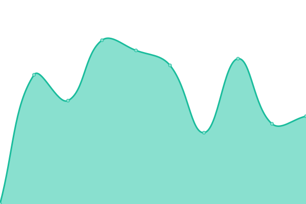

# [📈 Live Status](https://status.bando.cool): <!--live status--> **🟩 All systems operational**

This repository contains the open-source uptime monitor and status page for [bandohq](https://status.bando.cool), powered by [Upptime](https://github.com/upptime/upptime).

With [Upptime](https://upptime.js.org), you can get your own unlimited and free uptime monitor and status page, powered entirely by a GitHub repository. We use [Issues](https://github.com/bandohq/upptime-monitor/issues) as incident reports, [Actions](https://github.com/bandohq/upptime-monitor/actions) as uptime monitors, and [Pages](https://status.bando.cool) for the status page.

<!--start: status pages-->
<!-- This summary is generated by Upptime (https://github.com/upptime/upptime) -->
<!-- Do not edit this manually, your changes will be overwritten -->
<!-- prettier-ignore -->
| URL | Status | History | Response Time | Uptime |
| --- | ------ | ------- | ------------- | ------ |
|  [Bando Site](https://bando.cool) | 🟩 Up | [bando-site.yml](https://github.com/bandohq/upptime-monitor/commits/HEAD/history/bando-site.yml) | 

 393ms
     
 | 

<a href="https://status.bando.cool/history/bando-site">100.00%</a>
    

|  MXN Polygon On-ramps | 🟩 Up | [mxn-polygon-on-ramps.yml](https://github.com/bandohq/upptime-monitor/commits/HEAD/history/mxn-polygon-on-ramps.yml) | 

 1458ms
     
 | 

<a href="https://status.bando.cool/history/mxn-polygon-on-ramps">100.00%</a>
    

|  MXN Arbitrum On-ramps | 🟩 Up | [mxn-arbitrum-on-ramps.yml](https://github.com/bandohq/upptime-monitor/commits/HEAD/history/mxn-arbitrum-on-ramps.yml) | 

 4316ms
     
 | 

<a href="https://status.bando.cool/history/mxn-arbitrum-on-ramps">100.00%</a>
    

|  MXN Optimism On-ramps | 🟩 Up | [mxn-optimism-on-ramps.yml](https://github.com/bandohq/upptime-monitor/commits/HEAD/history/mxn-optimism-on-ramps.yml) | 

 3266ms
     
 | 

<a href="https://status.bando.cool/history/mxn-optimism-on-ramps">99.90%</a>
    

|  MXN Avalanche On-ramps | 🟩 Up | [mxn-avalanche-on-ramps.yml](https://github.com/bandohq/upptime-monitor/commits/HEAD/history/mxn-avalanche-on-ramps.yml) | 

 4054ms
     
 | 

<a href="https://status.bando.cool/history/mxn-avalanche-on-ramps">100.00%</a>
    

|  MXN BNB Smart Chain On-ramps | 🟩 Up | [mxn-bnb-smart-chain-on-ramps.yml](https://github.com/bandohq/upptime-monitor/commits/HEAD/history/mxn-bnb-smart-chain-on-ramps.yml) | 

 3764ms
     
 | 

<a href="https://status.bando.cool/history/mxn-bnb-smart-chain-on-ramps">100.00%</a>
    

|  MXN Base On-ramps | 🟩 Up | [mxn-base-on-ramps.yml](https://github.com/bandohq/upptime-monitor/commits/HEAD/history/mxn-base-on-ramps.yml) | 

 3383ms
     
 | 

<a href="https://status.bando.cool/history/mxn-base-on-ramps">100.00%</a>
    

|  MXN Celo On-ramps | 🟩 Up | [mxn-celo-on-ramps.yml](https://github.com/bandohq/upptime-monitor/commits/HEAD/history/mxn-celo-on-ramps.yml) | 

 2388ms
     
 | 

<a href="https://status.bando.cool/history/mxn-celo-on-ramps">100.00%</a>
    

|  MXN Scroll On-ramps | 🟩 Up | [mxn-scroll-on-ramps.yml](https://github.com/bandohq/upptime-monitor/commits/HEAD/history/mxn-scroll-on-ramps.yml) | 

 3776ms
     
 | 

<a href="https://status.bando.cool/history/mxn-scroll-on-ramps">100.00%</a>
    

|  MXN Blast On-ramps | 🟩 Up | [mxn-blast-on-ramps.yml](https://github.com/bandohq/upptime-monitor/commits/HEAD/history/mxn-blast-on-ramps.yml) | 

 3635ms
     
 | 

<a href="https://status.bando.cool/history/mxn-blast-on-ramps">100.00%</a>
    

<!--end: status pages-->

[**Visit our status website →**](https://status.bando.cool)

## 📄 License

- Powered by: [Upptime](https://github.com/upptime/upptime)
- Code: [MIT](./LICENSE) © [Anand Chowdhary](https://anandchowdhary.com), supported by [Pabio](https://pabio.com)
- Data in the `./history` directory: [Open Database License](https://opendatacommons.org/licenses/odbl/1-0/)
